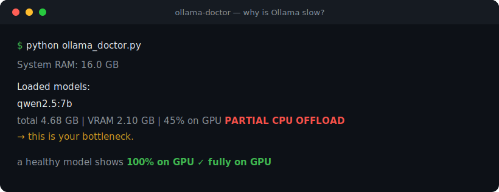

# ollama-doctor

**Find out *why* Ollama is slow — in one command.**



The most common reason "Ollama is crawling" is **silent CPU offloading**: the
model (or part of it) doesn't fit in your GPU's VRAM, so some layers run on the
CPU and throughput collapses by 10-50×. Ollama does this quietly and never tells
you. `ollama-doctor` asks the Ollama API what is actually loaded, shows how much
of each model sits in **VRAM vs system RAM**, and recommends a model/quant that
would actually fit.

## Quickstart

```bash
# load a model first, then diagnose while it's loaded:
ollama run qwen2.5:7b "hi"
python ollama_doctor.py
```

Example output:

```
Loaded models:
  qwen2.5:7b
    total 4.68 GB | VRAM 2.10 GB | 45% on GPU  ⚠️  PARTIAL CPU OFFLOAD
    → This is your bottleneck. Fix options below.
```

On a healthy machine the model sits fully in VRAM, and you also get the list of
installed models by size (real run):

```text
System RAM: 16.0 GB

Loaded models:
  gemma3:4b
    total 3.38 GB | VRAM 3.38 GB | 100% on GPU  ✅ fully on GPU

Installed models:
  nomic-embed-text:latest          0.26 GB
  gemma3:4b                        3.11 GB
  qwen2.5-coder:7b                 4.36 GB
```

## What it checks

- `/api/ps` — the running model's `size` vs `size_vram` (the % actually on GPU).
- `/api/tags` — installed models, sorted by size.
- System RAM (macOS `sysctl` / Linux `/proc/meminfo`).

## What it recommends

- A smaller model or lower quant that fits VRAM (with a rule-of-thumb VRAM table).
- Reducing context (`num_ctx`) to shrink the KV cache.
- `OLLAMA_MAX_LOADED_MODELS=1` to stop VRAM thrashing.
- When to just accept CPU and run a small model instead of a half-offloaded big one.

## Notes

- Pure Python standard library — no dependencies.
- The VRAM split comes straight from Ollama, so it's accurate across GPU vendors.
- Set `OLLAMA_URL` if Ollama isn't on `http://127.0.0.1:11434`.

## License

MIT

---

## See also
Part of a small collection of **local-first AI** and **ESP32 / maker** tools:

- [sqlite-memory](https://github.com/poerio1985-svg/sqlite-memory) — persistent long-term memory for local LLMs
- [sqlite-rag](https://github.com/poerio1985-svg/sqlite-rag) — minimal RAG — embeddings + cosine in SQLite, no vector DB
- [local-voice-edge](https://github.com/poerio1985-svg/local-voice-edge) — ESP32 voice assistant + local STT→LLM→TTS server
- [axs15231b-landscape-lvgl](https://github.com/poerio1985-svg/axs15231b-landscape-lvgl) — 3.5" AXS15231B QSPI panel in landscape with LVGL
- [guition-esp32p4-lvgl9](https://github.com/poerio1985-svg/guition-esp32p4-lvgl9) — Guition 7" ESP32-P4 + LVGL 9 baseline
- [orcaslicer-cli-cookbook](https://github.com/poerio1985-svg/orcaslicer-cli-cookbook) — OrcaSlicer from the command line + fixes

⭐ If this saved you time, a star helps others find it.
